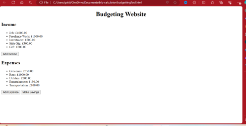

# Budgeting Website

A simple budgeting tool built using HTML, CSS, and JavaScript.

## Description

This budgeting website allows users to track their income, expenses, and make savings based on their financial activities. Users can add their income sources and expenses, view their total income, total expenses, disposable income, and save a portion of their disposable income into savings.

## Features

- Add income sources with name, amount, and recurring status.
- Add expenses with name, amount, and recurring status.
- Calculate total income, total expenses, and disposable income.
- Make savings by specifying the amount to save.

## Usage

1. Open the website in a web browser.
2. Enter income sources by clicking on the "Add Income" button, providing the name, amount, and recurring status.
3. Enter expenses by clicking on the "Add Expense" button, providing the name, amount, and recurring status.
4. View the list of income sources and expenses.
5. Click on the "Make Savings" button to save a portion of your disposable income.

## Preview

